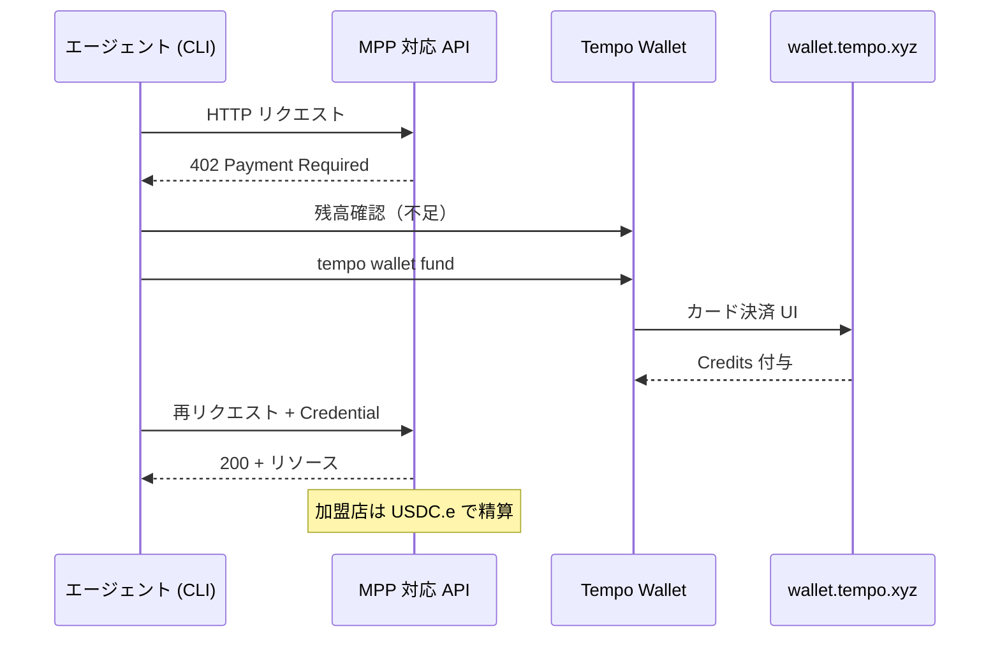

# MPP Credits：カードでエージェントに fund する（解説メモ）

出典: [Introducing MPP Credits: fund your agent with a card](https://tempo.xyz/blog/mpp-credits)（Tempo Blog、2026年6月17日公開）

プロトコル・CLI の正: **[Machine Payments Protocol (MPP)](https://mpp.dev/)**、**[Tempo CLI](https://docs.tempo.xyz/cli)**、**[Tempo Wallet（GitHub）](https://github.com/tempoxyz/wallet)**。高頻度従量課金の仕組みは **[docs/mpp-sessions.md](mpp-sessions.md)** を参照。

---

## 概要

**MPP Credits** は、開発者や AI エージェントが **クレジット／デビットカード**（Apple Pay / Google Pay 含む）で MPP 対応サービスの利用料を **前払い** する仕組み。Tempo Wallet 内でクレジットを購入し、エージェントが MPP 経由で従量課金 API（LLM 推論、コンピュート、データなど）に支払う。**加盟店は Tempo 上の USDC.e で数秒以内に精算** される（記事）。

記事の中心メッセージ:

| 論点 | 内容 |
|------|------|
| **何が変わったか** | エージェント fund に **「先に Tempo へステーブルコインを入れる」** だけでなく **カード直接** の経路が追加 |
| **UX の比喩** | OpenAI / AWS 等の **API クレジット** に近い — カード登録 → 購入 → 消費 |
| **MPP との関係** | MPP は任意の決済手段を想定。**Credits はカード経路の第一弾**（記事） |
| **横断性** | 単一プロバイダーではなく **Tempo がプロキシする MPP サービス横断** で使える |

---

## 背景：なぜ Credits か

これまでエージェントのウォレット fund は **Tempo 上にステーブルコインを移す** 必要があり、多くの開発者にとって余計なステップだった（記事）。カード→暗号資産オンボーディングは **初回決済で離脱率が高い** 歴史もあり、MPP Credits は **馴染みのある API クレジット型 UX** でその壁を下げる。

エージェントがタスク途中で残高不足になった場合、**保存済みカードで即トップアップ** し、エージェントを止めずに再開できる、とも記載。

---

## MPP Credits とは（通常残高との違い）

### API クレジットとの類似

1. カードを登録
2. クレジットを購入
3. エージェントが MPP サービスで消費

### 表向きの違い（記事）

| 観点 | 一般的な API クレジット | MPP Credits |
|------|------------------------|-------------|
| 保管場所 | 各プロバイダーアカウント | **Tempo Wallet 内** |
| 利用範囲 | 単一プロバイダー | **Tempo プロキシ MPP サービス横断** |
| 加盟店の受取 | 各社の決済・精算 | **USDC.e on Tempo（秒オーダー）** |
| 発行・カード処理 | 各社 | **Coinflow**（ライセンス取得 PSP） |

### 制約（記事が明示）

- **MPP サービスでのみ利用可** — 一覧は [mpp.dev/services](https://mpp.dev/services)
- **前払い・非返金** — 出金、他トークンへのスワップ、法定通貨への換金は不可。**ウォレット残高ではなく API クレジット** として扱う
- **対応決済手段** — クレジット／デビットカード（グローバル）、Apple Pay、Google Pay、保存カードによる即時チャージ

Coinflow が **カード処理** と **加盟店へのステーブルコイン即時精算** を担当する（記事）。

---

## 動作フロー



記事が述べる手順:

1. エージェントが MPP 対応 API を呼び、**402 Payment Required** を受ける
2. 残高不足なら `tempo wallet fund` — クレジット対応サービスでは **wallet.tempo.xyz** の標準チェックアウトへ誘導
3. カードを一度登録・保存 → 以降のトップアップは即時
4. エージェントが MPP サービス上で Credits をプログラム的に消費

402 フロー自体は [machine payments guide](https://docs.tempo.xyz/guide/machine-payments) の **Challenge → Pay → Credential → Receipt** と同じ。Credits は **Pay 段階の資金源** として Tempo Wallet 内に載る。

---

## CLI・ウォレット操作

| コマンド / URL | 用途 |
|----------------|------|
| [wallet.tempo.xyz/agent](https://wallet.tempo.xyz/agent) | 初回 Credits 購入（Agent payments ページ） |
| `tempo wallet login` | Passkey ベースの Tempo Wallet ログイン |
| `tempo wallet fund` | 残高不足時のチャージ（402 遭遇時も CLI が案内） |
| `tempo wallet fund --no-browser` | エージェントがリモートホスト、人間が別端末の場合（[wallet README](https://github.com/tempoxyz/wallet)） |
| `tempo wallet whoami --credits` | **Credits 残高** と **利用可能サービス** の確認 |
| `tempo request` | 402 交渉付き HTTP リクエスト |
| `tempo wallet services` | MPP サービス一覧・価格・スキーマ（[mpp.dev — Wallets](https://mpp.dev/tools/wallet)） |

エージェント向けセットアップの入口: [Tempo CLI](https://docs.tempo.xyz/cli) が案内する `https://tempo.xyz/SKILL.md`。

**初回の 2 通り:** [wallet.tempo.xyz/agent](https://wallet.tempo.xyz/agent) で先に購入するか、エージェントを Tempo CLI に向け **初回 402 で fund フローに入る** か（記事）。

---

## 既存 MPP 機能との関係

| レイヤ | 役割 | 本記事との関係 |
|--------|------|----------------|
| **MPP（402 フロー）** | HTTP 上のマシン決済 | Credits は **支払い手段の一つ** |
| **[charge](https://mpp.dev/payment-methods/tempo/charge) / [session](https://mpp.dev/payment-methods/tempo/session)** | 一回払い vs セッション従量 | どちらの intent でも Credits が **資金源** になりうる |
| **[MPP Sessions](mpp-sessions.md)** | オンチェーンを open/close の 2 回に集約 | セッション escrow も、従来はステーブルコイン前提 — Credits で **カードから fund** 可能に |
| **ステーブルコイン残高** | Tempo 上の USDC.e 等 | Credits とは **別物**（出金・スワップ不可） |

読み分け: **[mpp-sessions.md](mpp-sessions.md)** が **「大量マイクロペイメントをどうスケールするか」**、本メモが **「お金をどう入れるか（カード経路）」**。

---

## 利用可能サービス

- **Tempo がプロキシする MPP サービス** で受理 — LLM 推論、コンピュート、データ API など（記事）
- ディレクトリ: [mpp.dev/services](https://mpp.dev/services)
- 発見用 API: [mpp.dev/api/services](https://mpp.dev/api/services)、MCP: [mpp.dev/mcp/services](https://mpp.dev/mcp/services)
- **402 の Challenge がその場の正** — カタログは事前発見用。実行時の価格・受付方法は Challenge を信頼する（[machine payments guide](https://docs.tempo.xyz/guide/machine-payments)）

---

## 読者が止まりやすい点

### Credits と USDC.e 残高は同じ？

**いいえ。** Credits は MPP 専用の前払い残高。出金・他トークンへの変換・法定通貨への戻しはできない（記事）。通常の on-chain 残高とは `tempo wallet whoami --credits` で **別途確認** する。

### どのサービスで使える？

[mpp.dev/services](https://mpp.dev/services) の Tempo プロキシ MPP サービス。`whoami --credits` でも **残高と受付先** を確認できる（記事）。

### 402 を初めて踏んだエージェントは？

CLI が `tempo wallet fund` を案内。人間がブラウザでカードチャージすれば、エージェントは MPP フローを再開できる。

### アクセスキーとの関係

Credits は **fund（入金）** の話。アクセスキーは **署名権限と spend cap（誰がいくらまで署名できるか）** の話（[docs/access-keys.md](access-keys.md)、[docs/enterprise-payments.md](enterprise-payments.md)）。MPP Session の signer にアクセスキーを渡すパターン（[mpp-sessions.md](mpp-sessions.md)）と **併用可能** — Credits でウォレットに fund し、アクセスキーでエージェントに限定署名権を渡す、という二段構えになりうる。

### 日本では MoonPay 等の on-ramp が使えないのに、Coinflow は使えるのか？

**「Coinflow だけが日本向けの特別免許を持っているから」というより、売っている商品の性質と各社のコンプライアンス判断が違う**、という理解が近い。MoonPay と Coinflow が日本対応の差を公式に並べて説明した資料は、調査時点では見当たらない。

#### 商品の違い（規制上の見え方）

| | **MoonPay 等の crypto on-ramp** | **MPP Credits（Coinflow）** |
|---|-------------------------------|----------------------------|
| ユーザーが買うもの | **BTC / ETH 等の暗号資産**（ウォレットに入る） | **Tempo Wallet 内の MPP 専用 Credits**（前払い残高） |
| 出金・換金 | 売却・ fiat off-ramp あり | **不可**（記事・Coinflow 規約） |
| 日本で議論されやすい枠 | **暗号資産交換業（CAESP）** 寄り | **クローズドループの前払式商品** 寄り |

- **MoonPay:** [unsupported countries](https://support.moonpay.com/customers/docs/moonpays-unsupported-countries) に **Japan** が載る。BitBox ヘルプも「規制・コンプライアンス上の理由」とだけ記載。日本居住者向け crypto 購入・売却は提供しない。
- **Coinflow:** カード決済の [Supported Countries](https://docs.coinflow.cash/guides/checkout/payment-methods/supported-countries) に **Japan** が含まれる。ただしこれは **「日本で CAESP 登録済み」** の意味ではない。

#### Coinflow が MPP Credits をどう位置づけているか

Coinflow 規約では Credits を **prepaid, closed loop payment instrument**（デジタルギフトカードに近い）と定義している（[Coinflow Terms — Coinflow Credits](https://coinflow.cash/terms-of-service/)）。

- **単一加盟店向け** — 購入時に指定された Merchant（Tempo / MPP エコシステム）でのみ利用
- **譲渡不可・現金化不可** — 出金、他プラットフォームへの移転、 fiat 換金不可
- Coinflow は **発行・決済の technology provider**、Merchant 側が credits を発行する構造（同規約）

[How Checkout Works](https://docs.coinflow.cash/guides/checkout/checkout-overview/how-checkout-works) でも、Credits は **プラットフォーム内専用の prepaid** で、redeem 時に加盟店ウォレットへ精算される、と説明されている。**ユーザーは暗号資産を直接「購入」しているわけではない** — 裏側で加盟店が USDC 等を受け取るのは Merchant 精算の話。

#### 日本の規制との読み分け（一般論 — 本メモは法律助言ではない）

日本では **暗号資産の売買を事業として提供** する場合、原則 **金融庁への暗号資産交換業登録（CAESP）** が必要で、現地法人・厳しい管理体制などハードルが高い（[Payment Services Act 関連解説](https://globallawexperts.com/japan-payment-services-act-2026-guide/) 等）。MoonPay 型 on-ramp はこの枠に入りやすく、**日本を unsupported にする保守的判断** と読める。

一方、クローズドループの前払式商品は **資金決済法（前払式支払手段）** の論点になりうる。**自家型**（発行者の商品・サービスに限って使える）は一定規模までは **事前登録不要** で、未使用残高が基準日に 1,000 万円超で届出・供託等が論点になる、という整理が一般的（[日本資金決済業協会 — 前払式支払手段の概要](https://s-kessai.jp/businesses/prepaid_means_overview.html)）。

**MPP Credits が複数 MPP サービス横断で使える** 点は、厳密な法区分上グレーになりうる。ここから「完全に問題なし」とは断言できない。ただ **withdraw 可能な crypto をユーザーに渡す on-ramp** より、規制上・事業上の論点は別物。

#### なぜ「Coinflow だから日本 OK」に見えるか（整理）

```text
MoonPay:  カード → 暗号資産（自己保管ウォレットへ）
          └─ 日本: 暗号資産交換業の論点が強い → 提供停止

Coinflow: カード → クローズドループ Credits（MPP 専用・返金不可）
          └─ 裏側で加盟店へ USDC 精算（ユーザーは crypto を「購入」していない）
          └─ 日本: 対応国リストに含む（カード acquirer / 商品設計の都合）
```

加えて:

- **リスク許容度の差** — MoonPay は多数国を unsupported にしている一方、Coinflow は 170+ 国展開を謳い日本も pay-in 対象に含める
- **カード決済の経路** — 日本発行カードでも **海外 acquirer 経由の越境決済** になりうる
- **Tempo の商品設計** — Credits は MPP 専用・非返金と明示され、一般ウォレット残高や DEX 用トークンではない

#### 但し書き

| 論点 | 内容 |
|------|------|
| **必ず使えるわけではない** | カード会社拒否、KYC、上限等で個別に失敗しうる |
| **MoonPay の公式理由** | 日本除外の詳細理由は未公開 — 上記は商品差と日本規制の一般整理による推論 |
| **Coinflow の日本向け法的整理** | 対応国リスト ≠ 金融庁登録の有無。Tempo / Coinflow が日本向けにどの届出・登録を取っているかは **公開情報からは確認できない** |
| **最終確認** | 実際に使えるかは [wallet.tempo.xyz/agent](https://wallet.tempo.xyz/agent) の checkout が正 |

### 記事に書いていないこと

手数料率、最低購入額、Credits の有効期限、対応国・通貨の詳細は **本ブログには未記載**。実際の購入 UI（[wallet.tempo.xyz/agent](https://wallet.tempo.xyz/agent)）や Coinflow 側の規約を確認する必要がある。

---

## はじめるには・関連リンク

| リソース | URL |
|----------|-----|
| 本記事 | [tempo.xyz/blog/mpp-credits](https://tempo.xyz/blog/mpp-credits) |
| Credits 購入 | [wallet.tempo.xyz/agent](https://wallet.tempo.xyz/agent) |
| MPP サービス一覧 | [mpp.dev/services](https://mpp.dev/services) |
| Tempo CLI | [docs.tempo.xyz/cli](https://docs.tempo.xyz/cli) |
| Machine payments guide | [docs.tempo.xyz/guide/machine-payments](https://docs.tempo.xyz/guide/machine-payments) |
| MPP Wallets 比較 | [mpp.dev/tools/wallet](https://mpp.dev/tools/wallet) |
| MPP Sessions（従量スケール） | [docs/mpp-sessions.md](mpp-sessions.md) |
| Coinflow Credits 規約 | [coinflow.cash/terms-of-service](https://coinflow.cash/terms-of-service/) |
| Coinflow 対応国 | [docs.coinflow.cash — Supported Countries](https://docs.coinflow.cash/guides/checkout/payment-methods/supported-countries) |
| MoonPay unsupported（日本含む） | [support.moonpay.com — unsupported countries](https://support.moonpay.com/customers/docs/moonpays-unsupported-countries) |

---

## このメモについて

本ファイルは [MPP Credits ブログ](https://tempo.xyz/blog/mpp-credits) を起点にするが、**単なる要約ではない**。読者が止まりやすい論点（Credits vs 通常残高、402 フローとの関係、Sessions / アクセスキーとの読み分け、**日本と crypto on-ramp（MoonPay 等）との違い**）を解く。実装の入口は **`tempo wallet login` → 402 時 `tempo wallet fund` → `tempo request`**。
